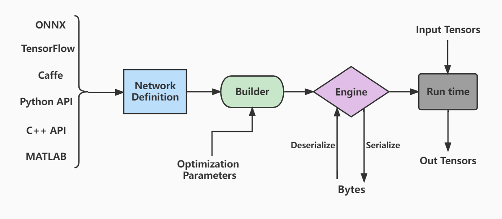
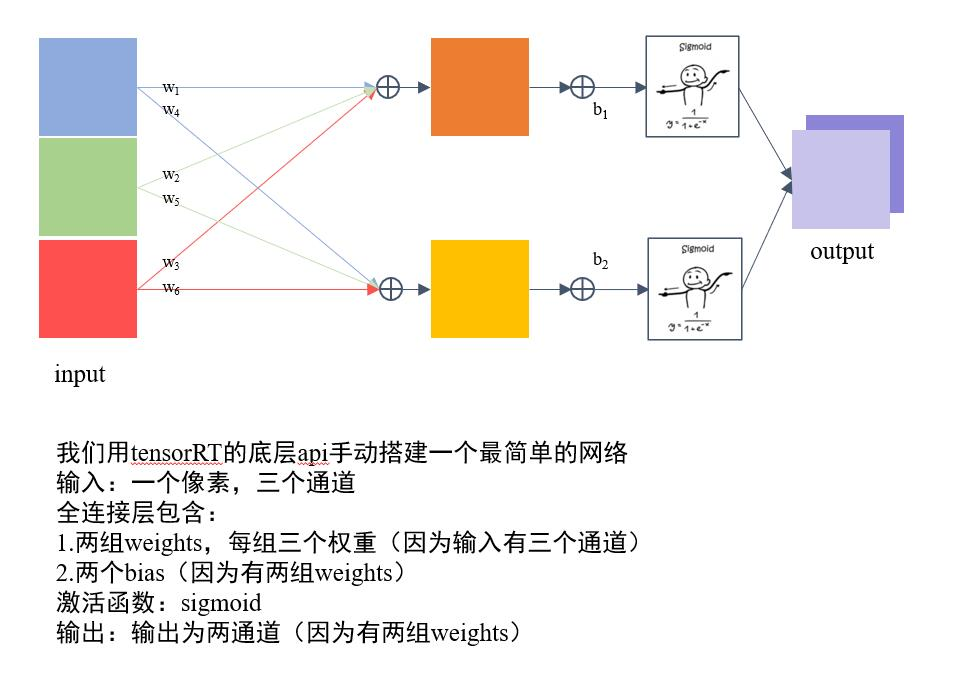

# 项目目标：了解tensorRT是怎么构建和编译一个模型的
## 运行
```
make run
```
## 知识点
- main.cpp 构建了一个最简单全连接网络
- tensorrt的工作流程如下图：
  - 首先定义网络
  - 优化builder参数
  - 通过builder生成engine,用于模型保存、推理等
  - engine可以通过序列化和逆序列化转化模型数据类型（转化为二进制byte文件，加快传输速率），再进一步推动模型由输入张量到输出张量的推理。
- code structure
   1. 定义 builder, config 和network，其中builder表示所创建的构建器，config表示创建的构建配置（指定TensorRT应该如何优化模型），network为创建的网络定义。
   2. 输入，模型结构和输出的基本信息（如下图所示）
   
   1. 生成engine模型文件
   2. 序列化模型文件并存储
- [官方文档参考部分 C++ API](https://docs.nvidia.com/deeplearning/tensorrt/developer-guide/index.html#:~:text=the%20Polygraphy%20repository.-,3.%C2%A0The%20C%2B%2B%20API,-This%20chapter%20illustrates)


=====================================================
IHostMemory 是 TensorRT 中的一个类，它代表了一块主机内存区域，可以通过指针访问。当调用 engine->serialize() 方法时，TensorRT 将模型数据序列化到 IHostMemory 对象中。然后，您可以将这块内存写入到文件系统中，以 .trtmodel 或其他后缀名保存。这个文件可以在之后被 TensorRT 引擎快速加载，用于执行推理。

在这段代码中，并没有直接使用 protobuf 库，而是使用 TensorRT 的 API 来处理序列化。不过，TensorRT 本身在序列化和反序列化过程中可能使用了 protobuf，这取决于其实现细节，通常是不需要开发者直接干预的。

protobuf是google开发的一种数据描述语言，它能够将结构化的数据序列化，并切可以将序列化的数据进行反序列化恢复原有的数据结构。一般用于数据存储以及通信协议方面。
https://blog.csdn.net/u014630623/article/details/88992609

tensorrt-8.6.1官方文档
https://docs.nvidia.com/deeplearning/tensorrt/api/c_api/_nv_infer_plugin_8h.html
