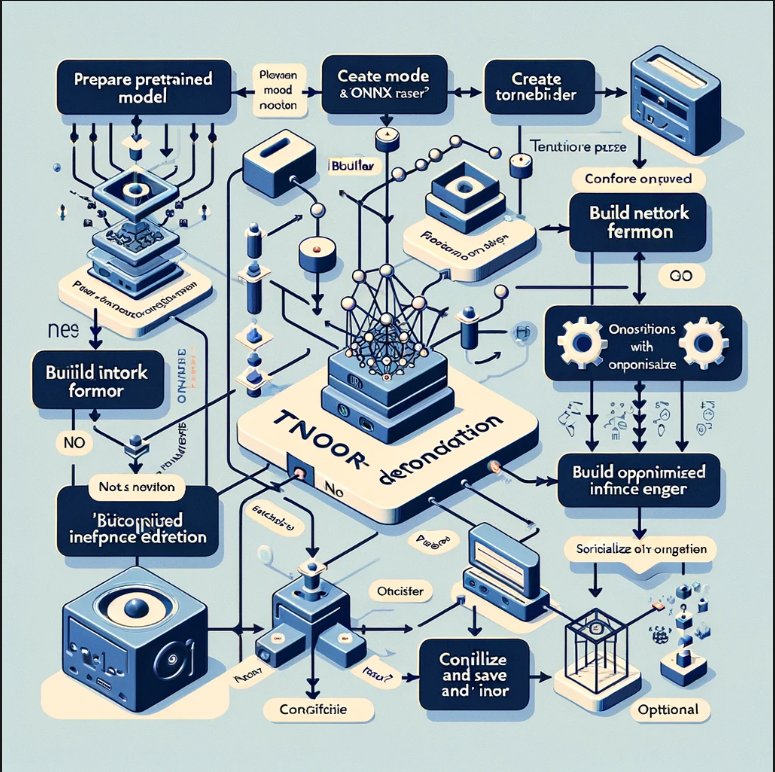

# TenosrRT
## Nvinfer1
`nvinfer1`是TensorRT的主要命名空间，它包含了TensorRT提供的大多数类和函数。TensorRT是一个由NVIDIA开发的高性能深度学习推理（Inference）引擎，用于加速深度学习应用程序在NVIDIA GPU上的运行速度。在TensorRT中，`nvinfer1`命名空间是核心组件，涵盖了构建、优化和部署深度学习模型所需的功能。

### 主要组件
#### 1. **`IBuilder`和`IBuilderConfig`**
- 这些类用于构建和配置优化的推理网络。`IBuilder`允许用户创建一个网络定义，而`IBuilderConfig`提供了各种优化选项，如精度设置、层融合策略等。
#### 2. **`INetworkDefinition`**
- 用于定义推理网络的结构。开发者通过添加层（如卷积层、全连接层等）来构建网络。
#### 3. **`ITensor`**
- 表示网络中的数据，是网络层输入和输出的基本单位。
#### 4. **`ILayer`**
- 网络中的层基类，特定类型的层（如卷积层、池化层等）继承自此基类。
#### 5. **`ICudaEngine`和`IExecutionContext`**
- `ICudaEngine`是优化后网络的表示，可以用来创建执行上下文（`IExecutionContext`）。执行上下文用于实际运行推理，它包含了执行推理所需的所有状态信息。
#### 6. **`Weights`类**
- 正如你在前一个问题中看到的，`Weights`类用于表示网络层的权重。它包含了权重的数据类型、数量以及指向权重数据的指针。
### 用途和重要性
- `nvinfer1`命名空间提供的类和函数直接关系到TensorRT的使用方式和性能优化能力。使用这些工具，开发者可以将预训练的深度学习模型转换为高效的推理引擎，显著提升在生产环境中的运行速度和效率。
- 在部署到实际应用之前，通过`nvinfer1`命名空间中的功能对模型进行精度调整和性能优化是一个重要步骤。这包括选择合适的精度（比如FP32、FP16或INT8），启用TensorRT的层融合和内存优化技术等。

通过熟悉和使用`nvinfer1`命名空间中提供的类和函数，开发者可以充分利用TensorRT的强大功能，为深度学习应用提供高性能的推理解决方案。


在TensorRT中执行推理的流程包含几个关键步骤，涉及到模型的转换、优化、序列化和最终的推理执行。这个流程充分利用了`nvinfer1`命名空间中的类和接口。下面是执行推理的基本步骤：

## TensorRT中执行推理的流程

### 1. **加载预训练模型**

首先，你需要有一个预训练的深度学习模型。这个模型可以是用TensorFlow、PyTorch等框架训练的，你需要将其转换为TensorRT支持的格式。TensorRT提供了解析器和转换工具来处理常见格式，如ONNX、Caffe等。

### 2. **创建`IBuilder`和`INetworkDefinition`**

```cpp
nvinfer1::IBuilder* builder = nvinfer1::createInferBuilder(gLogger);
nvinfer1::INetworkDefinition* network = builder->createNetworkV2(0U);
```

你需要创建一个`IBuilder`实例来定义和构建一个优化的推理网络，以及一个`INetworkDefinition`实例来描述网络结构。

### 3. **构建和优化模型**

使用`IBuilder`和`INetworkDefinition`，根据你的模型结构添加层和设置层参数。然后，通过`IBuilder`对网络进行优化，生成一个`ICudaEngine`：

```cpp
nvinfer1::ICudaEngine* engine = builder->buildCudaEngine(*network);
```

在这个过程中，你可以设置不同的优化配置，如精度、最大批处理大小等。

### 4. **创建`IExecutionContext`并执行推理**

`ICudaEngine`创建后，你可以用它来创建一个`IExecutionContext`：

```cpp
nvinfer1::IExecutionContext* context = engine->createExecutionContext();
```

`IExecutionContext`用于实际的推理执行。你需要准备好输入数据，调用`context->enqueue()`来执行推理：

```cpp
context->enqueue(batchSize, buffers, stream, nullptr);
```

其中`buffers`是指向输入和输出缓冲区的指针数组，`stream`是CUDA流，用于异步执行。

### 5. **处理推理结果**

推理完成后，输出数据会存储在输出缓冲区中。你可以处理这些数据来得到最终的推理结果。

### 6. **资源清理**

使用完毕后，释放所有使用过的资源，包括网络定义、执行上下文、引擎等，以避免内存泄漏。

这个过程展示了TensorRT在高性能推理方面的强大能力，通过精细的模型优化和执行过程，可以显著提升深度学习模型在生产环境中的运行效率。

## 学习TensorRT中的网络构建流程
TensorRT中的网络构建流程是将深度学习模型转换成优化后的推理引擎的过程，这涉及到模型的解析、优化和编译。这个流程使模型能够在NVIDIA GPU上高效运行，从而加速应用的推理性能。



下面是这个过程的关键步骤：

### 1. **准备预训练模型**
首先，你需要一个预训练的模型。这个模型可以是用任何主流深度学习框架（如TensorFlow, PyTorch, Keras等）训练的。为了在TensorRT中使用这个模型，你通常需要将它转换成一个中间表示格式，如ONNX（开放神经网络交换格式）。

### 2. **创建`IBuilder`和`INetworkDefinition`**
使用TensorRT的API创建一个`IBuilder`实例，它负责管理网络的构建过程。通过`IBuilder`，你可以创建一个`INetworkDefinition`，用于定义你的网络结构。

```cpp
auto builder = nvinfer1::createInferBuilder(gLogger);
auto network = builder->createNetworkV2(0U);
```

### 3. **模型解析和网络定义**
使用相应的解析器（如ONNX解析器），将你的模型导入到`INetworkDefinition`中。这个步骤会将模型中的层、权重等信息转换成TensorRT可以理解的格式。

```cpp
auto parser = nvonnxparser::createParser(*network, gLogger);
parser->parseFromFile(modelFile.c_str(), verbosity);
```

### 4. **优化配置（使用`IBuilderConfig`）**
创建一个`IBuilderConfig`实例，用于配置网络的构建选项，如精度、最大批量大小等。这里你可以启用TensorRT的各种优化功能，比如层融合、动态张量、精度校准等。

```cpp
auto config = builder->createBuilderConfig();
config->setMaxWorkspaceSize(1 << 20);
```

### 5. **构建优化后的推理引擎**
使用`IBuilder`和`IBuilderConfig`构建一个优化后的推理引擎（`ICudaEngine`）。这个引擎是对原始模型的高效表示，专门为特定的硬件配置优化。

```cpp
auto engine = builder->buildEngineWithConfig(*network, *config);
```

### 6. **序列化和保存推理引擎（可选）**
为了避免每次运行应用时都重复构建过程，你可以将构建好的引擎序列化并保存到文件中。之后可以直接加载引擎文件，快速启动推理。

```cpp
auto serializedEngine = engine->serialize();
// 保存serializedEngine到文件
```

### 7. **加载和执行推理**
加载构建（或序列化保存）的推理引擎，准备输入数据，执行推理，并处理输出结果。

这个流程是利用TensorRT加速深度学习模型推理的关键。通过这些步骤，开发者可以将模型从训练阶段迁移到高效的生产推理阶段，显著提高应用的性能。

## TensorRT 优化技巧

探索TensorRT的优化技巧是提升深度学习模型推理性能的关键。TensorRT提供了多种方法来优化模型，以下是一些常用的优化技巧：

### 1. **使用合适的精度**
- **混合精度（Mixed Precision）**：利用TensorRT的混合精度功能，结合FP32、FP16和INT8精度，可以显著提升推理性能，同时在保证精度的前提下减少模型大小。
- **INT8量化**：通过量化模型到INT8精度，进一步减少模型大小和提升推理速度，尤其在支持INT8运算的硬件上。进行INT8量化时，可能需要进行精度校准以保证模型的输出精度。

### 2. **层融合和张量融合**
- TensorRT会自动尝试将多个层融合成一个更高效的层（Layer Fusion），这可以减少内存访问次数并提升执行效率。
- 张量融合（Tensor Fusion）通过合并操作来减少内存读写，进一步优化模型性能。

### 3. **动态形状和静态形状**
- **动态形状**支持让模型能够以不同的输入形状进行推理，提升模型的灵活性。使用动态形状时，需要在构建时和推理时指定输入形状范围或特定的输入形状。
- 对于**静态形状**模型，提前确定输入形状可以帮助TensorRT更好地优化模型。

### 4. **流水线执行和异步推理**
- 利用CUDA流（Streams）可以实现推理任务的并行处理，通过流水线（Pipelining）方式来提升GPU利用率和推理吞吐量。
- 异步推理可以在不阻塞主线程的情况下执行推理任务，利用GPU和CPU的并行处理能力。

### 5. **序列化和反序列化引擎**
- 将优化后的推理引擎序列化到磁盘，可以加快后续启动和推理的速度。加载预构建的引擎比每次都重新构建引擎要快得多。

### 6. **使用TensorRT API进行细粒度优化**
- TensorRT提供了丰富的API和配置选项，允许开发者进行更细粒度的模型优化。了解并合理使用这些API能够进一步提升模型性能。

通过这些优化技巧，可以显著提升TensorRT模型的推理速度和效率，尤其是在NVIDIA GPU上。针对特定的应用场景和硬件配置，合理选择和结合这些技巧，可以达到最佳的性能优化效果。

##  探索如何使用TensorRT进行动态形状推理

在TensorRT中使用动态形状进行推理，可以让你的模型更加灵活地处理不同大小的输入，这在处理变化的图像尺寸或序列长度时非常有用。动态形状推理允许模型在不重新构建引擎的情况下，接受和处理不同尺寸的输入数据。这里是如何实现动态形状推理的关键步骤：

### 1. **定义动态形状**

在创建`INetworkDefinition`时，你需要为网络输入指定动态形状的范围。这通过设置输入张量的最小尺寸、最优尺寸和最大尺寸来实现。

```cpp
// 假设network是你的INetworkDefinition实例，inputName是你输入张量的名称
auto input = network->getInput(0);
nvinfer1::Dims minDims = input->getDimensions();
nvinfer1::Dims optDims = input->getDimensions();
nvinfer1::Dims maxDims = input->getDimensions();

// 修改这些维度以表示动态形状的范围
// 例如，对于批量大小可变，其他维度固定的情况
minDims.d[0] = 1; // 最小批量大小
optDims.d[0] = 8; // 最优批量大小（最常见的批量大小）
maxDims.d[0] = 16; // 最大批量大小

// 设置动态形状的范围
input->setDimensions(minDims);
network->getProfile(0)->setDimensions(inputName, nvinfer1::OptProfileSelector::kMIN, minDims);
network->getProfile(0)->setDimensions(inputName, nvinfer1::OptProfileSelector::kOPT, optDims);
network->getProfile(0)->setDimensions(inputName, nvinfer1::OptProfileSelector::kMAX, maxDims);
```

### 2. **配置构建选项以支持动态形状**

在构建引擎时，你需要使用一个或多个优化配置文件（Optimization Profiles），每个配置文件对应一组输入形状的范围。

```cpp
auto config = builder->createBuilderConfig();
// 为每个配置文件设置工作空间大小
config->setMaxWorkspaceSize(1 << 20);
// 为引擎添加配置文件
config->addOptimizationProfile(profile);
```

### 3. **在推理时选择合适的优化配置文件**

在推理执行前，根据当前输入数据的实际大小选择合适的优化配置文件。通过`IExecutionContext`设置输入形状：

```cpp
auto context = engine->createExecutionContext();
// 根据实际输入数据设置输入形状
context->setBindingDimensions(inputIndex, currentDims);
// 检查是否可以执行推理
if (context->allInputDimensionsSpecified()) {
    // 执行推理
}
```

### 4. **处理不同形状的输入**

现在，你的模型可以根据输入数据的实际大小在运行时动态调整，无需重新构建引擎。

使用动态形状推理可以显著提高模型处理不同输入尺寸数据的灵活性和效率，特别适用于那些输入数据尺寸变化较大的场景，如不同分辨率的图像处理或可变长度文本处理等。


