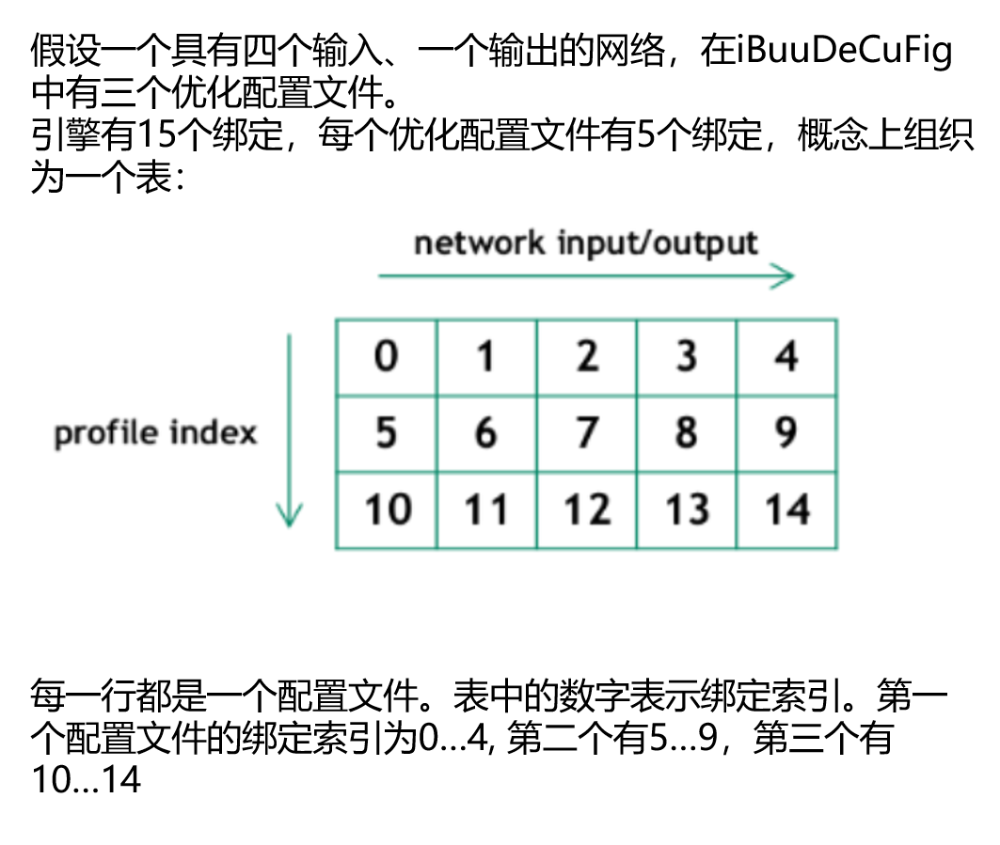

# 项目目标：用tensorRT动态shape去进行cnn推理
- 注意：1.1 和 1.2 都是全连接网络，1.3是卷积神经网络

## 知识点
1. 构建网络时：
    - 1.1. 必须在模型定义时，输入维度给定为-1，否则该维度不会动态。注意一下两点：
        - 1.1.1. 若onnx文件，则onnx文件打开后应该看到为动态或者-1
        - 1.1.2. 如果你的模型中存在reshape类操作，那么reshape的参数必须随动态进行计算。而大部分时候这都是问题。除非你是全卷积模型，否则大部分时候只需要为batch_size维度设置为动态，其他维度尽量避免设置动态
    - 1.2. 配置profile:
       - 1.2.1. create: `builder->createOptimizationProfile()`
       - 1.2.2. set: `setDimensions()`设置`kMIN`, `kOPT`, `kMAX`的一系列输入尺寸范围
       - 1.2.3. add:`config->addOptimizationProfile(profile);`添加profile到网络配置中
2. 推理阶段时：
    - 2.1. 您需要在选择profile的索引后设置`input`维度：`execution_context->setBindingDimensions(0, nvinfer1::Dims4(1, 1, 3, 3));` 
      - 2.1.1. 关于profile索引:
        
      - 2.1.2. 在运行时，向engine请求绑定维度会返回用于构建网络的相同维度。这意味着，得到的还是动态的维度[-1, in_channel, -1, -1]：
        ```cpp
        engine.getBindingDimensions(0) // return [-1, 1, -1, -1]
        ```
        获取当前的实际维度，需要查询执行上下文：
        ```cpp
        context.getBindingDimensions(0) // return [3, 1, 3, 3]
        ```

3. 检查正确性
    - 我们通常可以利用pytorch来校验是否发生了错误


## 运行
c++ 部分
```bash
make run
```
python 部分 (用来验证c++的结果对不对)
```python
python conv-test.py
```

=======================================================================
### profile 相关解读
在 NVIDIA TensorRT 中，一个优化配置文件（Optimization Profile）是用于定义网络输入张量尺寸的动态范围的一种机制。这对于具有可变输入尺寸（例如不同大小的图像输入）的网络特别重要。通过定义这些范围，TensorRT 可以在给定的范围内针对性能进行优化，同时保持对不同输入尺寸的支持。

注释“如果模型有多个输入, 则必须有多个 profile”指的是，在处理具有多个输入张量的模型时，特别是当这些输入可能具有不同的动态尺寸范围时，你需要为每个输入创建一个优化配置文件。这样做是为了确保 TensorRT 可以理解每个输入的尺寸变化范围，并据此优化模型。

下面的代码行：
```cpp
auto profile = builder->createOptimizationProfile();
```
这行代码创建了一个新的优化配置文件。通过这个 `profile`，你可以为模型中的每个输入指定最小尺寸、最优尺寸和最大尺寸。然后，这些配置文件将用于构建阶段，帮助 TensorRT 生成一个针对这些尺寸范围优化的引擎。

具体来说，如果你的模型有两个输入，每个输入根据实际应用场景可能有不同的尺寸变化，你需要为每个输入创建并配置一个优化配置文件。例如：

```cpp
// 为第一个输入创建优化配置文件
auto profile1 = builder->createOptimizationProfile();
// 设置第一个输入的最小、最优、最大尺寸
profile1->setDimensions(inputName1, OptProfileSelector::kMIN, Dims4(1, C1, H1_min, W1_min));
profile1->setDimensions(inputName1, OptProfileSelector::kOPT, Dims4(1, C1, H1_opt, W1_opt));
profile1->setDimensions(inputName1, OptProfileSelector::kMAX, Dims4(1, C1, H1_max, W1_max));

// 为第二个输入创建优化配置文件
auto profile2 = builder->createOptimizationProfile();
// 设置第二个输入的最小、最优、最大尺寸
profile2->setDimensions(inputName2, OptProfileSelector::kMIN, Dims4(1, C2, H2_min, W2_min));
profile2->setDimensions(inputName2, OptProfileSelector::kOPT, Dims4(1, C2, H2_opt, W2_opt));
profile2->setDimensions(inputName2, OptProfileSelector::kMAX, Dims4(1, C2, H2_max, W2_max));
```
在这个示例中，`inputName1` 和 `inputName2` 是输入张量的名称，`C1` 和 `C2` 是通道数，`H1_min`, `H1_opt`, `H1_max`, `W1_min`, `W1_opt`, `W1_max`，以及对应的 `H2` 和 `W2` 值分别代表不同输入的高度和宽度的最小值、最优值和最大值。

通过这种方式，TensorRT 可以为具有复杂输入要求的模型生成高度优化的推理引擎。

---------------------------------------------------------------------------------------------
### fstream中的ios命名空间解读
在 C++ 中，`fstream` 是用于文件操作的一个类，包括读取文件 (`ifstream`) 和写入文件 (`ofstream`)。`fstream` 库包含在标准库 `<fstream>` 中，它提供了文件输入输出的功能。而 `ios` 是一个命名空间（实际上是一个类，但在这个上下文中通常被看作是提供命名空间功能的一部分），它定义了一些基本的输入/输出操作的类型和变量。

`ios` 实际上代表了输入/输出流的基类 `std::ios_base`，它定义了所有标准输入输出流对象共有的属性和方法。这包括用于控制格式化（如十进制、十六进制输出）、文件模式（如读/写模式）和状态标志（如 good, eof, fail, 和 bad）的枚举和函数。

在使用 `fstream`（或其派生的 `ifstream` 和 `ofstream`）进行文件操作时，`ios` 命名空间（实际上是 `std::ios_base` 类）中定义的模式和标志经常被用来设置文件流的打开模式和处理状态。例如：

```cpp
#include <fstream>

int main() {
    // 使用 ofstream 打开文件，指定模式为输出和截断模式
    std::ofstream outfile("example.txt", std::ios::out | std::ios::trunc);

    if (outfile.is_open()) {
        outfile << "Writing this to a file.\n";
        outfile.close();
    }

    // 使用 ifstream 打开文件，指定模式为输入
    std::ifstream infile("example.txt", std::ios::in);
    std::string line;

    if (infile.is_open()) {
        while (getline(infile, line)) {
            std::cout << line << '\n';
        }
        infile.close();
    }

    return 0;
}
```

在这个例子中，`std::ios::out` 和 `std::ios::trunc` 是从 `std::ios_base` 继承的打开模式标志，它们分别表示打开文件进行写操作，以及在打开文件时截断文件，从而删除文件中的所有现有内容。同样，`std::ios::in` 表示打开文件进行读操作。

总的来说，`ios` 在文件操作中用于指定文件流的行为和状态，它是通过继承自 `std::ios_base` 的方式在 `fstream`、`ifstream` 和 `ofstream` 中使用的。