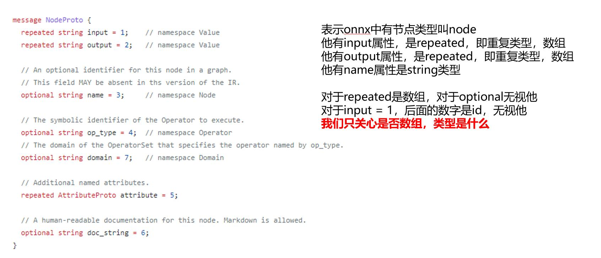
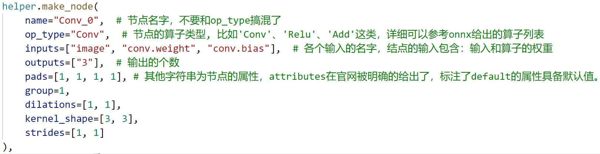

# 知识点
## 本项目抖音短视频辅助讲解
   - 0. 为什么要编辑onnx https://v.douyin.com/NPsJ4TV/
   - 1. pytorch生成onnx https://v.douyin.com/NPshBrF/
   - 2. 读取onnx https://v.douyin.com/NPsFELA/
   - 3. 编辑和创建onnx https://v.douyin.com/NPshVCL/！

## 本小节主要讲解onnx的原理，文件较多，我们一个一个慢慢来看：
1. `pytorch-gen-onnx.py`：是之前讲过的从pytorch转换onnx格式的代码。
2. 通过`onnx-ml.proto`和`make-onnx-pb.sh`了解onnx的结构
   - 2.1. onnx是基于protobuf来做数据存储和传输,*.proto后缀文件, 其定义是protobuf语法，类似json。
   - 2.2. 对于变量结构、类型等，我们可以参照`onnx-ml.proto`里面的定义。这个文件有800多行，放心我们只要搞清楚里面的核心部分就行：
       - `ModelProto`:当加载了一个onnx后，会获得一个`ModelProto`。它包含一个`GraphProto`和一些版本，生产者的信息。
      - `GraphProto`: 包含了四个repeated数组(可以用来存放N个相同类型的内容，key值为数字序列类型.)。这四个数组分别是node(`NodeProto`类型)，input(`ValueInfoProto`类型)，output(`ValueInfoProto`类型)和initializer(`TensorProto`类型)；
      - `NodeProto`: 存node，放了模型中所有的计算节点,语法结构如下：
        
      - `ValueInfoProto`: 存input，放了模型的输入节点。存output，放了模型中所有的输出节点；
      - `TensorProto`: 存initializer，放了模型的所有权重参数
      - `AttributeProto`:每个计算节点中还包含了一个`AttributeProto`数组，用来描述该节点的属性，比如Conv节点或者说卷积层的属性包含group，pad，strides等等；
   - 2.3. 通过protoc编译`onnx-ml.proto`，产生`onnx-ml.pb.cc`文件
        ```bash
        bash make-onnx-pb.sh
        ```
3.  create-onnx.py
       - 3.1. create-onnx.py直接从构建onnx，不经过任何框架的转换。通过import onnx和onnx.helper提供的make_node，make_graph，make_tensor等等接口我们可以轻易的完成一个ONNX模型的构建。
       - 3.2. 需要完成对node，initializer，input，output，graph，model的填充
       - 3.3. 读懂creat-onnx.py以make_node为例：
          
4.  edit-onnx.py
       - 4.1. 由于protobuf任何支持的语言，我们可以使用[c/c++/python/java/c#等等]实现对onnx文件的读写操作
       - 4.2. 掌握onnx和helper实现对onnx文件的各种编辑和修改
         - 增：一般伴随增加node和tensor
            ```python
            graph.initializer.append(xxx_tensor)
            graph.node.insert(0, xxx_node)
            ```
         - 删：
            ```python
            graph.node.remove(xxx_node)
            ```
         - 改：
             ```python
             input_node.name = 'data'
            ```
5.  read-onnx.py
    - 5.1 通过`graph`可以访问参数，数据是以protobuf的格式存储的，因此当中的数值会以bytes的类型保存。需要用`np.frombuffer`方法还原成类型为`float32`的`ndarray`。注意还原出来的`ndarray`是只读的。

=============================================================================================

`protoc` 是 Protocol Buffers（protobuf）的编译器，用于将 protobuf 文件（`.proto` 文件）编译成指定编程语言的源代码。Protocol Buffers 是 Google 开发的一种语言中立、平台中立、可扩展的序列化结构数据的方法，非常适合于数据存储和通信协议。

### 主要功能

- **编译 `.proto` 文件**：`protoc` 能够读取 `.proto` 文件中定义的数据结构，并生成对应编程语言的类或数据结构，以及序列化和反序列化这些结构的代码。这意味着你可以在一种语言中定义数据结构，然后轻松地在多种编程语言中使用这些结构。

- **支持多种编程语言**：`protoc` 支持多种输出语言，包括 C++、Java、Python 等，也可以通过插件支持更多语言，如 Go、Ruby、C# 等。

### 使用示例

假设你有一个 `message.proto` 文件，内容如下：

```proto
syntax = "proto3";

message Person {
  string name = 1;
  int32 id = 2;
  string email = 3;
}
```

你可以使用 `protoc` 来生成特定语言的代码。例如，为了生成 Python 代码，你可以在命令行中运行：

```bash
protoc -I=$SRC_DIR --python_out=$DST_DIR $SRC_DIR/message.proto
```

其中，`$SRC_DIR` 是 `.proto` 文件所在的目录，`$DST_DIR` 是你希望生成的 Python 代码所放置的目录。

### 安装 `protoc`

`protoc` 的安装方法取决于你的操作系统。通常，你可以从 [GitHub Protocol Buffers Releases 页面](https://github.com/protocolbuffers/protobuf/releases)下载对应系统的预编译二进制文件，或者通过包管理器（如 apt、brew）安装。安装后，你可以通过命令行运行 `protoc --version` 来检查是否安装成功。

### 总结

`protoc` 是一个强大的工具，它使得使用 Protocol Buffers 定义并跨多种编程语言共享结构化数据变得简单。通过自动生成序列化代码，它还有助于提高开发效率和减少出错的机会。