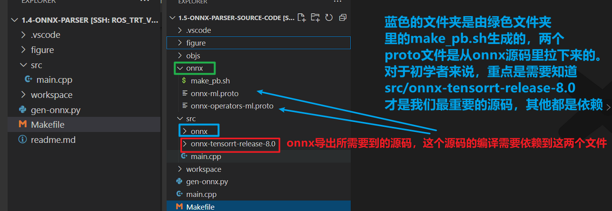
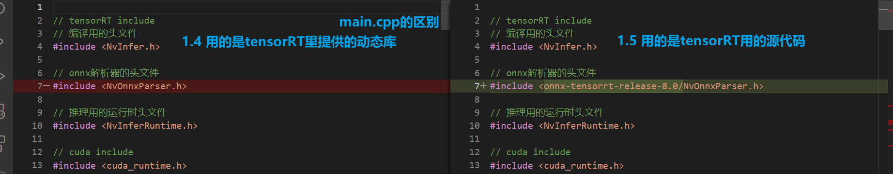

# 知识点
1. 目标：本小节学习如何从源码编译onnx解析器
   -文件结构：
   
2. nvonnxparser已经被nvidia给开源了，可以使用官方自带的解析器，也可以使用源代码进行编译
- <details> <!-- -->
     <summary> 详情 </summary>

   - 为了使用onnx导出网络有两种方式
     - 方法1： 我们使用自带的解析器，已经是动态库了, trtpy 也提供了放在特定地址下
         - 例：/datav/software/anaconda3/lib/python3.9/site-packages/trtpy/trt8cuda112cudnn8/lib64/libnvonnxparser.so
     - 方法2：要么我们直接使用源代码来编译
       - 源代码下载地址：https://github.com/onnx/onnx-tensorrt/tree/release/8.0
     - 参考figure/structure.png 有助于理解本项目与上一个项目的差异
       - [onnx-ml.proto 来源](https://github.com/onnx/onnx/blob/main/onnx/onnx-ml.proto)
       - [onnx-operators-ml.proto 来源](https://github.com/onnx/onnx/blob/main/onnx/onnx-operators-ml.proto)
       
 </details> <!-- -->

2. 如果需要在其他地方使用解析器，请把onnx下的pb文件，使用protoc进行编译后得到头文件，替换src/onnx下的文件
3. onnx本质上是一个protobuf序列化后储存的文件，因此他依赖了protobuf做反序列化解析
4. 使用源代码进行编译的好处是，可以对其进行定制化，例如插件部分的时候，或者不支持的新算子的时候
5. 1.4 与 1.5 的在`main.cpp`中的唯一区别是：
    - 1.4 指定的是自带的解析器
    - 1.5 是从源码编译解析器
      

# 执行方式
1. 生成onnx文件
      ```python
      python gen-onnx.py
      ```
     - 要求安装有pytorch
     - 产生的文件会储存在workspace下
     - 产生的demo.onnx可以使用netron进行打开查看
2. 执行编译trt模型
    ```
    make run
    ```


# 编译proto
1. `bash onnx/make_pb.sh`执行编译，它会自动复制文件到src/onnx下

===============================================================================================
## C++内存映像
在C++中，程序的内存布局通常可以分为几个部分：堆（Heap）、栈（Stack）、数据段（Data Segment）、BSS段、代码段（Text Segment）等。每个部分存储着不同类型的变量和数据。

1. **堆（Heap）**：动态分配的内存区域，程序员可以控制何时分配和释放。这里通常存储动态创建的对象和数据。虽然堆的使用提供了灵活性，但分配和回收内存的速度较慢，并且需要通过指针来访问。如果不适当管理，还可能导致内存泄露。

2. **栈（Stack）**：自动管理的内存区域，主要用于存储函数的局部变量、参数和调用上下文。栈有着后进先出（LIFO）的特性，当函数调用时，其参数和局部变量会被压入栈中，函数返回时这些数据则会被自动移除。栈的操作速度快，但空间有限。

3. **数据段（Data Segment）**：存储程序中已初始化的全局变量和静态变量。这个区域在程序编译时就已确定大小，并且在程序运行期间保持不变。

4. **BSS段**：存储未初始化的全局变量和静态变量。和数据段类似，它在程序启动时被分配，但初始时不占用实际的磁盘空间，只是在内存中预留位置。

5. **代码段（Text Segment）**：包含了程序的执行代码。这部分内存是只读的，以防止程序代码被意外修改。除了代码，固定的常量值也存储在这个区域。

每个部分的存储内容和特点决定了它们在程序设计中的使用方式。例如，由于堆空间的灵活性和可动态分配的特性，它适用于存储生命周期不确定或需要在多个函数间共享的数据。而栈则适用于存储生命周期明确，作用域局限于单个函数内的临时数据。

了解这些内存区域的工作原理对于编写高效、稳定的C++程序至关重要，特别是在处理大量数据、进行内存管理和优化性能时。

关于内存管理的详细解释，你可以参考以下资源：
- Learn C++ 提供了对栈和堆的详细解释 [https://www.learncpp.com/cpp-tutorial/the-stack-and-the-heap/]。
- DEV Community 对内存布局的说明提供了对这些概念的高级概述 [https://dev.to/alfielytorres/the-memory-layout-explained-4d73]。

------------------------------------------------------
## 极简使用ONNXParser生成engine
#include <onnx-tensorrt-release-8.6/NvOnnxParser.h>

下载 onnx-tensorrt:
https://github.com/onnx/onnx-tensorrt/tree/main

下载的版本要和机器上安装的tensorrt版本匹配, 给onnx-tensorrt中的库文件及与 builtin_op_importers.cpp 关系不大的文件都给删掉

完成这一步后, 尝试运行项目把onnx转成engine, 发现报错: 
src/onnx/onnx_pb.h:53:10: fatal error: onnx/onnx.pb.h: 没有那个文件或目录

下载 onnx：
https://github.com/onnx/onnx

将该项目中onnx/onnx的内容复制出来, 其余删除, 最后再把该文件夹中不以onnx结尾的文件都给删掉

打开修改后的onnx文件夹中的 onnx.pb.h，发现最后有几行代码如下：
```cpp
#ifdef ONNX_ML
#include "onnx/onnx-ml.pb.h"
```
通过ONNX_ML(Machine learning)推测得知onnx-ml.pb.h及其实现(onn-ml.pb.cpp)就是实现这个功能的关键, 下面来生成 onn-ml.pb.cpp 这个文件

需要用到 onnx-ml.proto 文件, 注释掉该文件最后几行内容:
```cpp
// For using protobuf-lite
option optimize_for = LITE_RUNTIME;
```
这么做的原因是避免 该文件依赖 protobuf-lite.so, 而是依赖 protobuf.so, 否则会造成很多问题

在onnx文件夹下执行下面命令:
```bash
protoc onnx-ml.proto --cpp_out=./
```
会生成 onnx-ml.pb.cc 这个文件, 然后把后缀名改成.cpp文件, 否则无法被Makefile识别

对 onnx_pb.h 的内容进行修改:
```cpp
#ifndef ONN_PB_H
#define ONNX_PB_H

#include "onnx-ml.pb.h"

#endif // ONN_PB_H
```
然后重新进行make run

报错如下：src/onnx-tensorrt-release-8.6/onnx2trt_utils.hpp:356:45: error: ‘::onnx’ has not been declare

将onnx目录下的ONNX_NAMESPACE全部替换成onnx

再次编译报错: 
```makefile
src/onnx-tensorrt-release-8.6/ImporterContext.hpp:120:30: note: ‘std::make_unique’ is only available from C++14 onwards
```
另一个错误是:
```bash
protobuf: undefined reference to `google::protobuf::internal::fixed_address_empty_string
```
https://blog.csdn.net/weixin_44736938/article/details/113886868

解决办法都是, 修改makefile中的代码：
```bash
stdcpp    := c++14

# 定义库文件路径，只需要写路径，不需要写-L
library_paths := $(cuda_home)/lib64 \
				 $(tensorrt_home)/lib \
				 $(syslib) $(cpp_pkg)/opencv4.2/lib \
				 /usr/lib/x86_64-linux-gnu/
# 添加protobuf库
link_flags        += $(library_paths) $(link_librarys) $(run_paths) -lprotobuf
```
再次make run 成功